# Game Design Document (GDD)

### Table of contents
* [Introduction](#introduction)
* [Game Overview :space_invader:](#Game-Overview)
    * [Related Genres](#Related-Genres)
    * [Target Audience](#Target-Audience)
    * [Similar Games](#similar-games)
    * [Unique Selling Point](#Unique-Selling-Point)
* [Story and Narratives :book:](#Story-and-Narratives)
    * [Backstory](#Backstory)
    * [Characters](#Characters)
* [Gameplay and Mechanics :video_game:](#Gameplay-and-Mechanics)
    * [Player Perspective](#Player-Perspective)
    * [Controls](#Controls)
    * [Progression](#Progression)
    * [Gameplay Mechanics](#Gameplay-Mechanics)
* [Levels and World Design :world_map:](#Levels-and-World-Design)
    * [Game World](#Game-World)
    * [Objects](#Objects)
    * [Physics](#Physics)
* [Art and Audio :notes:](#Art-and-Audio)
    * [Art Style](#Art-Style)
    * [Sound and Music](#Sound-and-Music)
* [User Interface :jigsaw:](#User-Interface)
* [Technology and Tools :hammer_and_wrench:](#Technology-and-Tools)
* [Team Communication](#Team-Communication)
* [Possible Challenges](#Possible-Challenges)

### Introduction
Echoes of the Reactor is a puzzle solving/adventure/survival game that plunges players into a post nuclear meltdown world, where the remnants of human technology lie forgotten and decayed. The game is set within the confines of a long destroyed nuclear power plant, a place that was once a beacon of progress but is now a treacherous place of ruin and radiation. Your mission is to retrieve a crucial item hidden deep within the plant’s labyrinthine corridors, but the path to success is fraught with peril. Players must use their wits, tools, and knowledge to navigate the dangers that lurk within the plant and successfully complete their mission :test_tube:. 

> "This game is the next best thing after the invention of sandwiches." - Game Designer

### Game Overview
#### Related-Genres
- **Primary Genres**
    - Puzzle Solving: The game challenges players with intricate puzzles that tests logical thinking, pattern recognition, and problem-solving skills.
    - Exploration: The environment of the abandoned power plant is designed to evoke tension and unease. Players must explore the claustrophobic and ominous environments to fully discover the unsettling world, all while avoiding dangers that lurks in the shadows.
    - Survival (Radiation): The game will incorporate survival elements where players must avoid or mitigate radiation exposure, all while making strategic decisions to ensure their survival in a hazardous environment.
- **Secondary Genres**
    - Science Fiction: The backdrop of the game involves advanced technology, industrial decay, mutated creatures and a post-catastrophic apocalypse scenario.
    - Thriller: The game incorporates elements of psychological thrill, using the eerie, abandoned setting of the power plant to create a tense atmosphere. The constant threat of radiation, along with the desolate environment, all adds to the overall sense of dread and urgency.

#### Target-Audience
Young Adults: The game particularly appeals to young adults who enjoy narrative-driven games with complex mechanics, exploration, survival, and puzzle-solving within a rich, atmospheric environment. Sounds like you? If so...

  

...to test our game.

#### Similar-Games
All great games are built on the foundations laid by those that came before them. Below is a list of the games that have significantly inspired the development of Echoes of the Reactor.
- **Lethal Company**: Similar in its use of a survival horror experience, where players must salvage and survive in a dangerous environment filled with threats. The sense of vulnerability is a common thread.

  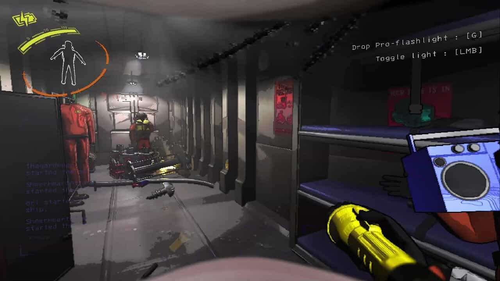
  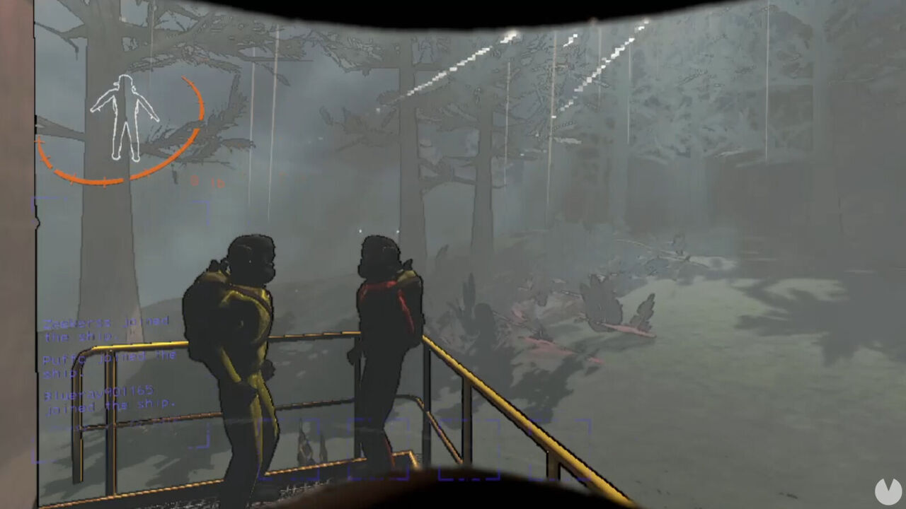

- **Dead Space**: A survival horror game that masterfully combines tense atmosphere, puzzle-solving, and the exploration of a decrepit, isolated environment. The theme of surviving in a hostile, closed-off space resonates with the core elements of our game.

  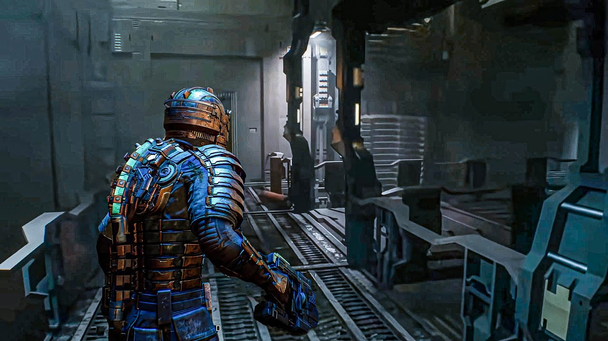
  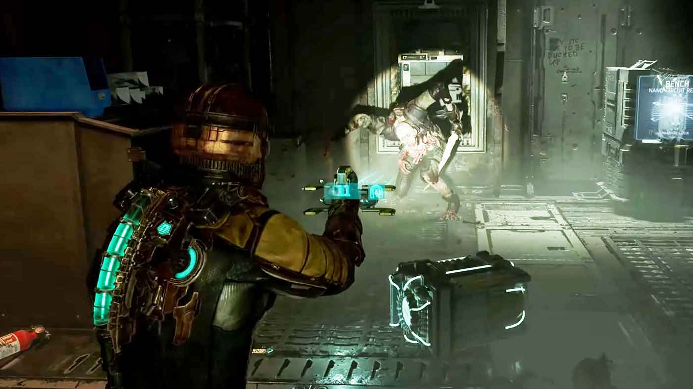

- **Little Nightmares**: Similar to the eerie atmosphere and 2.5D graphical style that made Little Nightmares so captivating. The game plunges you into a world that is as unsettling as it is intriguing, where every shadow hides a new threat, and every decision could be your last. 

  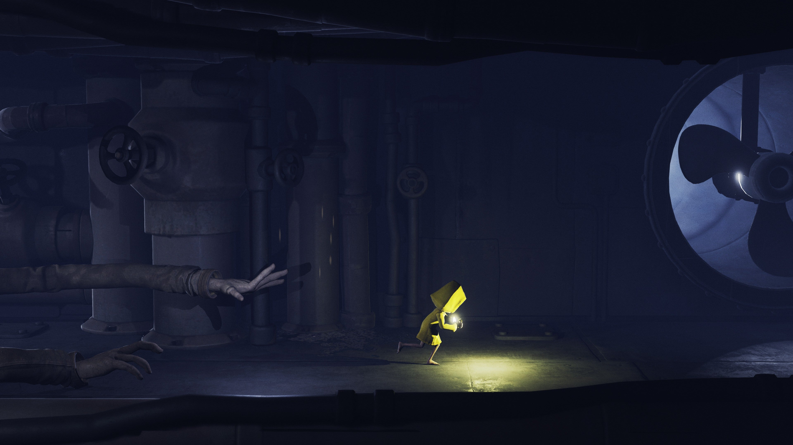
  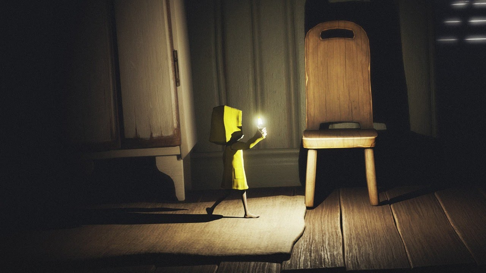

#### Unique-Selling-Point
- **Mutated Animals** - In post meltdown environment, some animals have undergone bizarre mutations:
    - Super Long Neck Giraffe: A giraffe with an unusually long neck can be found in the game. If fed by players, they can climb its neck to reach otherwise inaccessible areas, allowing for more vertival exploration.
    - Mutated Cat: Another unique animal is the mutated cat. When given cat food, it will crawl into small, hard-to-reach spaces to retrieve key items. 
    - Zombie Dog: As the representative of man's best friend, when given food this ferocious dog will knock down obstacles and doors alike clearing the way for the player. All of these animals adds a strategic element, where players must decide how to use the limited pet food to solve puzzles and progress through the game.

  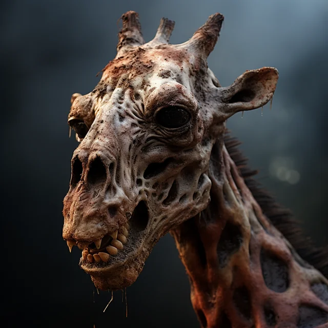
  
  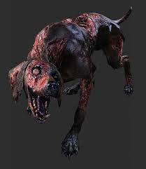

- **Previous Player Deaths**
    - This adds a layer of replayability, where previous player deaths leave behind corpses that hint at past mistakes, deepens the immersion and challenge, making the game both intriguing and memorable.

### Story-and-Narratives
#### Backstory
Decades ago, a catastrophic nuclear meltdown occurred at the [Name of Power Plant], leading to one of the worst disasters in history. The incident rendered the entire area uninhabitable, leaving behind a ghostly, irradiated wasteland. The government quickly sealed off the plant, and the surrounding region was left to decay, its secrets buried under layers of radioactive dust and twisted metal. Rumors of what truly happened inside the plant have circulated ever since, but no one has dared to investigate—until now.

The game is set within the ominous and desolate confines of the [Name of Power Plant]. This sprawling industrial complex, once a marvel of technological advancement, now stands as a decaying monument to human hubris. The player is tasked with exploring this forsaken facility, where every corner hides a potential danger or a clue to the mysteries that lie within. The plant’s labyrinthine structure is filled with rusting machinery, dark corridors, and radiation hotspots that threaten to end the player’s journey prematurely. Despite the decay, something valuable or vital remains hidden deep within, and it’s up to the player to retrieve it.

The player faces not only the physical dangers of the power plant but also the mental challenge of solving intricate puzzles scattered throughout the facility. These puzzles guard access to vital areas and the key item needed to complete the mission. However, the player is not alone in this endeavor. The irradiated environment has given rise to mutated animals, strange creatures that have adapted to the toxic surroundings. By offering food to these animals, the player can bribe them to assist in completing tasks—whether it’s retrieving items from small, inaccessible spaces or providing a means to reach higher ground.

#### Characters
- The Player (Protagonist) 
    - **Background**: Government Agent/Former Worker: The player is a highly trained operative or former worker sent by the government to retrieve a vital piece of technology or information from the power plant. They have a deep understanding of nuclear technology and the dangers of radiation, which makes them uniquely qualified for this mission. However, the player has a past connection to the plant—perhaps they were involved in its construction, or they have personal ties to someone who was lost in the meltdown.
    - **Motivations**: Government Agent/Former Worker: The player is motivated by duty and the potential to uncover crucial information that could prevent future disasters. They may also be driven by a desire to atone for past mistakes or to uncover the truth behind the meltdown.
    - **Relationships**: With the Animals: The player views the mutated animals as both tools and companions. They recognize that these creatures are survivors, just like themselves, and while they may use them to achieve their goals, there could be a growing sense of empathy or respect as the game progresses.
    - **With the Mutated Shark (Final Boss)**: The shark represents the ultimate manifestation of the plant’s horrors. It’s a symbol of the unchecked power and mutation that the player has been fighting against. Their encounter with the shark could be seen as the final test of their resolve, where survival instincts clash with the overwhelming danger.
    - **Personality**: Government Agent/Former Worker: Logical, disciplined, and focused. This character is methodical in their approach to challenges, always seeking the most efficient solution. They are pragmatic, often prioritizing the mission over personal feelings, but they may have moments of vulnerability when confronted with the plant’s darker secrets.

  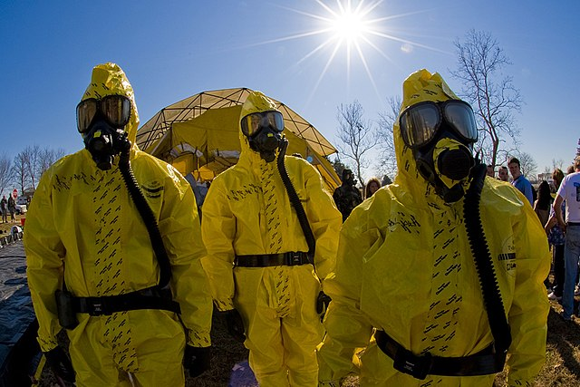

- Mutated Animals (Supporting Characters)
    - **Background**: These creatures were once ordinary animals, but exposure to radiation has drastically altered them. Despite their strange appearances, they have retained some of their natural instincts and can be surprisingly helpful to the player.
    - **Motivations**: The animals are driven by basic survival needs, such as food. They are not inherently malevolent but have adapted to their new environment. Their motivations align with the player’s when food or safety is offered.
    - **Relationships with the Player**: The animals see the player as a source of food and perhaps protection. The relationship is symbiotic—each party benefits from the other, but the animals are not loyal; their cooperation is purely transactional.
 

  
  
  

- The Mutated Shark (Final Boss/Villain)
    - **Background**: Once an ordinary shark, this creature has mutated beyond recognition due to the intense radiation. It now possesses legs, allowing it to traverse the plant’s flooded and dry areas with terrifying speed and power. The shark is the result of the plant’s worst horrors and represents the uncontrolled power that caused the meltdown.
    - **Motivations**: The shark is a predator, driven by instinct and aggression. It views the player as both a threat and prey. Its presence is a constant reminder of the dangers lurking within the plant, and its final confrontation with the player is inevitable.
    - **Relationships with the Player**: The shark is the ultimate obstacle, the embodiment of the plant’s dark legacy. The player’s goal is to survive and defeat this monstrous creature, which symbolizes the last barrier between them and the completion of their mission.
    - **Personality**: The shark doesn’t have a traditional personality but embodies pure, relentless aggression. It is a force of nature, driven by a need to hunt and destroy anything that crosses its path.

  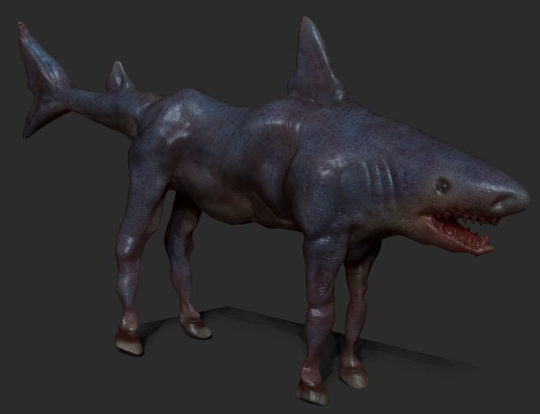

### Gameplay-and-Mechanics
#### Player-Perspective
- **Game View**: The game is presented as a 2.5D side-scroller, where the player navigates the environment from a side view while still interacting with a three-dimensional world. The camera follows the player along a fixed path, providing a dynamic view of the abandoned power plant's hazardous corridors and traps. This perspective allows players to experience the depth of the environment while maintaining the simplicity of side-scrolling gameplay.
- **Third-Person Perspective**: The player character is visible on the screen, with the camera fixed to the player's position, offering a consistent view of the environment and the character’s actions.

  

#### Controls
**Movement**: WASD keys control movement

- W: Move up (e.g., climb ladders or navigate upward).
- A: Move left.
- D: Move right.
- S: Move down (e.g., descend ladders or crouch).
- SPACE: Jump

**Interaction**: The E key is used to interact with objects in the environment, such as levers, doors, or feeding animals.

**No Special Combinations**: The controls are straightforward with no complex combinations, making the game accessible while still challenging.

#### Progression
Checkpoint System:
- **First Checkpoint**: The player is tasked with restoring electricity to the abandoned power plant, setting the stage for further exploration. This involves solving puzzles and avoiding environmental hazards.

- **Second Checkpoint**: The player encounters a flooded level and must locate and open a valve to drain the water, introducing a new layer of environmental interaction.

- **Third Checkpoint**: The climax occurs here, where the player retrieves the key item, triggering a collapse of the building. The player must then navigate back through previous areas, now crumbling and more dangerous.

**Final Boss Battle**: The player faces off against the mutated shark-horse, a challenging boss that tests all the skills learned throughout the game.
**Increasing Difficulty**: As the game progresses, the environment becomes more hazardous, especially after the third checkpoint when the building begins to collapse, adding pressure and urgency to the gameplay.

Game Over Conditions:
- **Running Out of Time**: The player must complete the game within 10 minutes, adding a layer of tension and encouraging quick thinking.
- **Caught by the Final Boss**: The final boss presents a direct threat that can end the game if the player is caught.
  
Replay Value:
- **Speedrun Element**: The game encourages players to replay in order to complete it in the shortest time possible, appealing to those who enjoy the challenge of improving their performance.

#### Gameplay-Mechanics
- **Feeding Mutated Animals**: A core mechanic involves feeding mutated animals to complete tasks. For example, giving food to a giraffe with an elongated neck allows the player to climb it and reach higher areas. This mechanic introduces strategic resource management, as players must decide when and how to use their limited food supply.
- **Atmospheric Navigation**: The game’s environment is crafted to create an intense, immersive experience rather than a traditional maze. Players navigate through eerie, claustrophobic spaces where every step forward uncovers new dangers and unsettling discoveries. 

### Levels-and-World-Design
#### Game-World
Rules and "Laws" Governing the Game World:
- **Radiation Zones**: Certain areas are irradiated, forcing the player to avoid or quickly pass through them. Staying too long in these zones results in health deterioration or immediate death.
- **Persistent World**: Each time the player dies, their body remains in the game world. These bodies serve as reminders of previous attempts and can be seen by the player in subsequent runs, adding a layer of continuity and narrative depth.
- **Environmental Hazards**: The plant is filled with traps, unstable structures, and other hazards that can cause injury or death. These hazards are governed by physics and the game’s environmental rules, requiring players to be constantly vigilant.

  

#### Levels
Level 1: `The Power Plant Entrance`
- **Overview**: The player begins at the entrance of the power plant, a dark and foreboding area that sets the tone for the rest of the game. This level focuses on teaching the player basic controls and mechanics, such as interacting with objects and feeding mutated animals to solve simple puzzles.
**Key Objectives**: Restore electricity to the power plant
- **Visuals**: Flickering lights, sparking wires, and broken machinery dominate the environment, creating a sense of unease.

  

Level 2: `The Flooded Chambers`
- **Overview**: In this level, the player must navigate through the plant’s lower chambers, which have been flooded due to the meltdown. This level introduces new challenges, such as avoiding drowning and finding a way to drain the water to proceed.
- **Key Objectives**: Locate and open the valve to drain the water, allowing further exploration of the plant.
- **Visuals**: Dark, murky water fills the lower chambers, with debris floating ominously. The lighting is dim, with only a few functional lights casting eerie reflections on the water’s surface.

  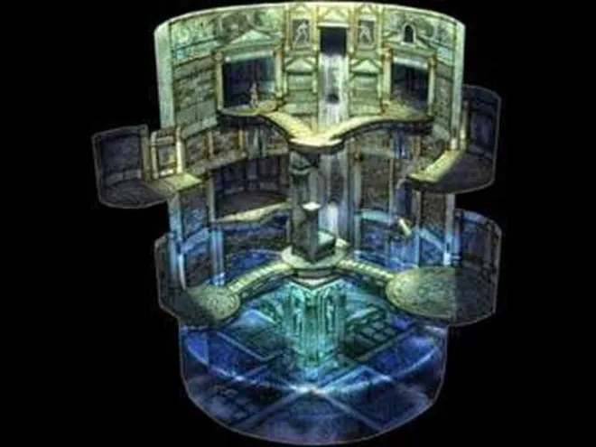

Level 3: `The Reactor Core`
- **Overview**: The final level takes place deep within the plant, near the reactor core. Here, the player must navigate a rapidly deteriorating environment, solving the final puzzles to retrieve the key item. This level culminates in a frantic escape sequence as the plant begins to collapse.
- **Key Objectives**: Retrieve the key item and escape the collapsing plant, culminating in a tense battle with the mutated shark-horse.
- **Visuals**: The reactor core is a chaotic, unstable environment with steam, radiation, and debris filling the screen. The sense of danger is palpable, with the entire area shaking and crumbling as the player progresses.

  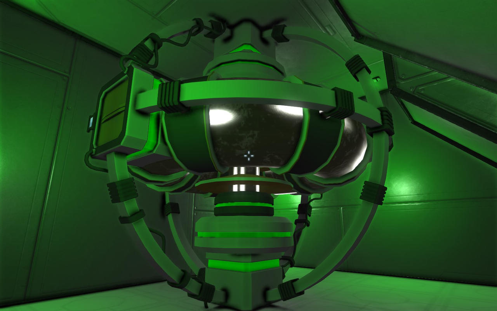

#### Objects
- **Mutated Animals**: These creatures, altered by radiation, vary in appearance and behavior. Players must feed them or perform specific actions to gain their help. They interact directly with the player, often becoming key to solving puzzles or overcoming obstacles.

> "I showed you the animal multiple times already" - Game Designer

- **Medicine Packs**: The game would initially start with a 5 minutes timer. Each medicine pack extends the game by another one minute. Scattered throughout the levels, these packs are essential for treating the player's radiation exposure, helping to keep them alive as they navigate the hazardous environment. They are usually hidden.

  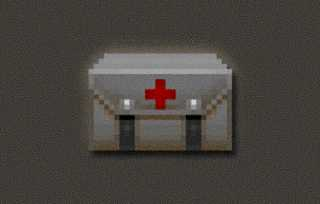

- **Keys and Cards**: These items unlock doors or access points, allowing the player to advance through the levels. They are often guarded or require solving a puzzle to obtain.

  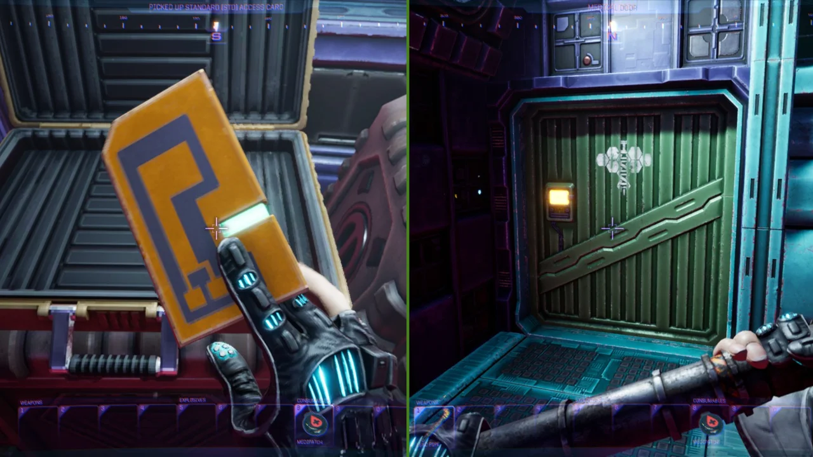

- **Food Packets**: Used to bribe the mutated animals, these packets are crucial for gaining the assistance of the creatures in the power plant.

  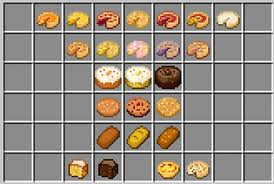

- **Doors, Elevators, and Security Rooms**: These are key elements of the environment, controlling access to different areas. Doors may require keys or cards to open, elevators provide vertical movement, and security rooms may contain important controls or information.

  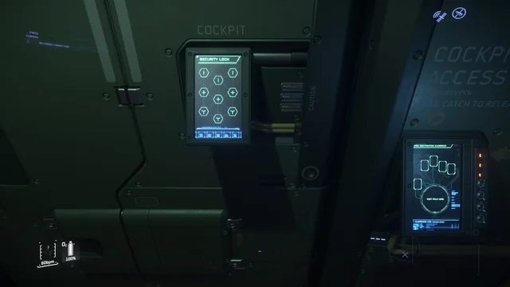

- **Electricity Control Panel**: This panel is central to the first checkpoint, where the player must restore power to the facility. Interacting with this panel is necessary to progress to the next level.

  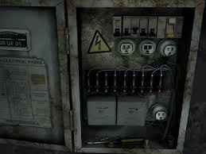

- **Valve and Pipes**: These objects are part of the puzzle in the second checkpoint, where the player must drain a flooded area. The valve, when turned, interacts with the pipes to release water, clearing the way forward.

  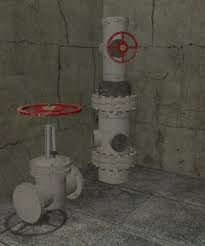

- **Stairs and Ladders**: These provide vertical movement within the levels, allowing the player to reach different floors or bypass obstacles.

  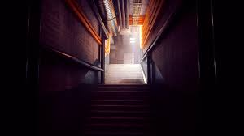

- **Final Item (TBD)**: This is the ultimate goal of the player’s quest, a crucial object needed to complete the game. Its exact nature is still to be determined, but it will be heavily guarded and likely trigger the final level’s challenges.

- **Final Boss (Horse Shark)**: This mutated creature is the game’s final challenge, encountered after obtaining the key item. It is an aggressive and dangerous opponent, requiring the player to use all the skills and knowledge they’ve gained to defeat it and escape the collapsing building.

  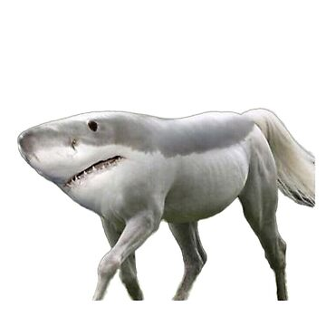

#### Physics
- **Regular Physics**: The game world follows realistic physics, with objects moving and reacting in a believable manner. Gravity, momentum, and collision are all simulated to create a cohesive, immersive experience.
- **Object Interaction**: Objects within the game world interact naturally. For example, when a mutated animal pushes a door or wall, it reacts as expected, either opening or collapsing. The mutated shark-horse boss can also interact with the environment, breaking through walls or doors during its pursuit of the player.

### Art-and-Audio
#### Art-Style

**Arts style**
- The game will aim for a `realistic` art style to immerse the player in the environment. The focus will be on detailed textures, lifelike lighting, and environmental effects.

**Visual Appearance**
- The game will prioritize creating an `eerie and fitting` atmosphere, even if strict realism cannot be achieved due to time constraints. While the goal is to achieve a realistic visual appearance, the team is open to adjustments as needed.

**Colors, Shapes, and Textures**
- The primary colors of the game’s environment are gray and dark blue/green. Grey dominates the scene, symbolizing decay and abandonment, while dark blue and green accentuate shadows, contributing to a cold and unsettling mood. The shapes within the game are rugged and angular, with structures and objects featuring sharp, worn edges that emphasize disrepair and danger. Textures like cracked walls and rusty metal equipment further enhance the atmosphere, representing the passage of time, neglect, and the long-term abandonment that defines the game's eerie setting.
  

  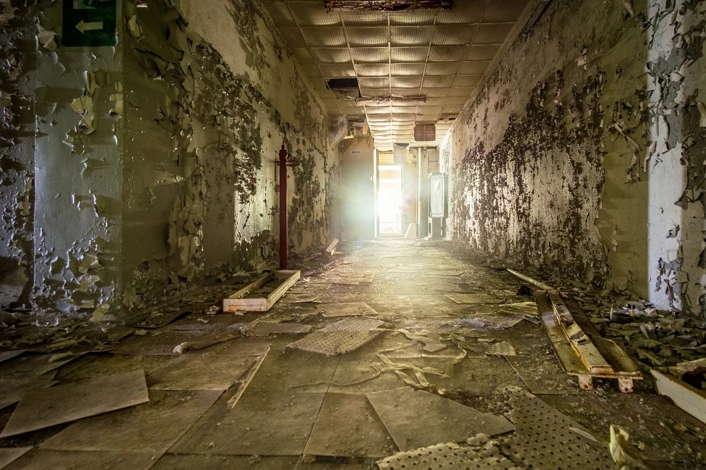
  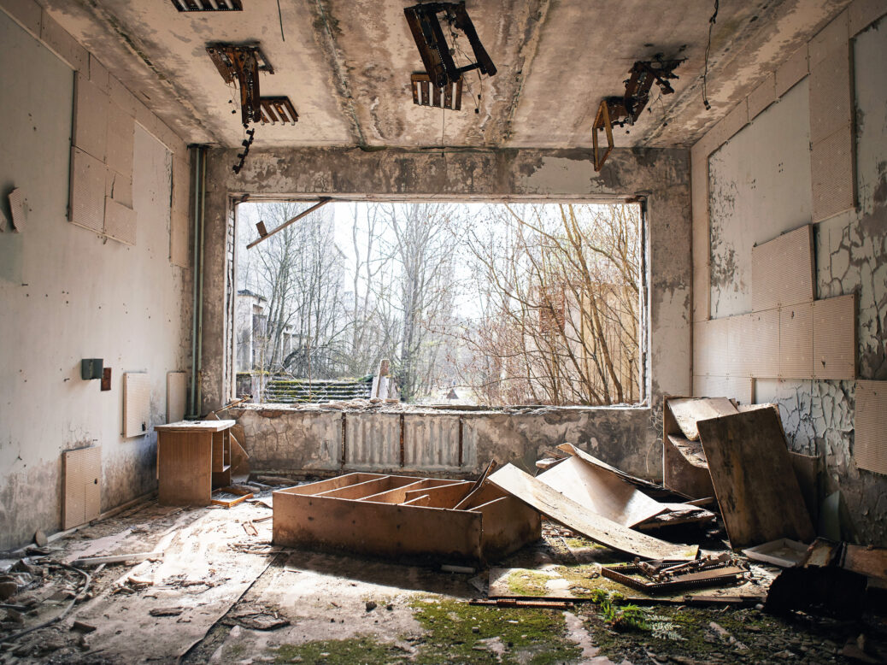

**Overall Aesthetic**
- The game environment will convey a sense of looming danger and desolation, with pervasive signs of neglect and deterioration. The atmosphere is crafted to instill a feeling of isolation and discomfort as players navigate through the world.

#### Sound-and-Music
**Sounds**
- The sound design of the game features eerie and highly suspenseful sound, which enhances the tension and unease throughout the gameplay. Sounds like metal creaking, water dripping (especially in level 2), and warning alarms are used to amplify the feeling of danger and abandonment. Click below for more information :loud_sound:.
   - [:sweat_drops:](https://freesound.org/people/Sclolex/sounds/177958/)
   - [:door:](https://freesound.org/people/pagancow/sounds/15418/)
   - [:ocean:](https://freesound.org/people/deleted_user_8803593/sounds/436576/)

**Music**
- The music consists of low humming and ominous tones, perfectly complementing the game's creepy, dilapidated, and perilous environment. Together, the sounds and music align seamlessly with the game's aesthetic, reinforcing the atmosphere of a forgotten and dangerous world. Check it out, we prepared a few :musical_note:.
   - [:musical_note: 1](https://freesound.org/people/rhapsodize/sounds/135433/)
   - [:musical_note: 2](https://freesound.org/people/DeVern/sounds/435662/)

### User-Interface
The game's user interface (UI) is designed with a focus on functionality, ensuring that players can easily access vital information while maintaining immersion in the game world. 

The UI elements include:
- **Radiation Timer**: The radiation timer tracks the player's exposure to radiation. As the player progresses through the levels, the timer decreases, reflecting the increasing danger.

  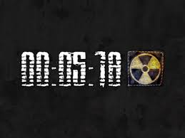

- **Main Menu**: The main menu appears when the game is first launched or when the player pauses the game. It features options for starting a new game, continuing a current game, accessing settings, and exiting. The menu design is simple, with a dark, industrial aesthetic that matches the game's atmosphere.

  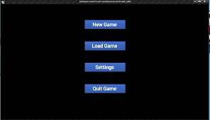

### Technology-and-Tools
For the development of the game, the following technology and tools will be utilized :computer::
- **Unity**: Unity is the primary game engine used for developing the game. It is well-suited for creating 2.5D side-scrollers and offers a robust set of tools for physics, animation, and UI design. Unity’s extensive asset store and community support make it an ideal choice for this project.
- **GitHub**: GitHub will be used for version control, allowing for collaborative development, tracking changes, and ensuring code integrity. GitHub’s integration with Unity ensures smooth collaboration and project management, with options for branching and merging code.
Visual Studio Code (VS Code): VS Code is the code editor of choice, offering a lightweight, yet powerful environment for writing and debugging C# scripts. Its integration with GitHub and Unity enhances productivity, and its extensive library of extensions allows for customizable workflows.
- **C#**: C# is the programming language used within Unity for scripting game mechanics, UI interactions, and gameplay logic. Its object-oriented nature and compatibility with Unity make it the ideal language for this project.
- **WebGL**: WebGL will be used to deploy the game as a web application, making it accessible directly from browsers. This choice allows for easy sharing and distribution of the game without requiring players to download and install additional software.
  
Optional Tools:
- **Image Editing Software**: Tools like Adobe Photoshop or GIMP may be used for creating or editing game textures, UI elements, and other 2D assets. These tools are not required but can be useful for refining the visual aspects of the game.
- **Audio Editing Software**: Software such as Audacity could be used for editing sound effects or background music, ensuring they fit the game's atmosphere and tone.
- **3D Modeling Software**: Blender could be employed for creating or modifying 3D assets, particularly if unique models are needed for mutated animals or environmental objects. This tool is optional and would depend on the project’s asset requirements.
  
These tools and technologies have been chosen for their effectiveness, compatibility with Unity, and ability to support the overall goals of the project.

### Team-Communication
For team communication, task assignment, and project timelines, the following plan will be implemented:

- Primary Channels:
    - **Discord/WeChat**: Discord and WeChat will be used for daily communication, quick updates, and general discussions. Channels will be organized by topic (e.g., #discussion, #project-repo) to keep conversations focused.
    - **Discord/In-person**: Weekly meetings will be held via discord or in-person to discuss progress, address any roadblocks, and plan for the upcoming week. These meetings will provide a space for real-time collaboration and problem-solving.
  
- Secondary Channels:
    - **Email**: Important updates, meeting minutes, and formal documentation will be shared via email. This ensures that key information is easily accessible and can be referred to later.
GitHub Issues and Pull Requests: For code-specific communication, GitHub will be used to track bugs, feature requests, and code reviews. This keeps development discussions organized and tied directly to the relevant codebase.

- Project Management Tool:
    - **Trello**: Trello will be used to assign tasks, set deadlines, and track progress. Boards will be created for each major aspect of the project (e.g., Development, Art & Design, Testing). Tasks will be broken down into actionable items, with each team member assigned specific tasks based on their expertise.
    - **Kanban Board**: A Kanban-style board will be implemented in Trello to visualize the workflow, from “To Do” to “In Progress” to “Completed,” making it easy to track the status of each task.
  
- Task Distribution:
    - **Development**: Developers will be assigned to work on specific game features, such as implementing gameplay mechanics, creating UI elements, and integrating assets.
    - **Art & Design**: Designers will focus on creating and refining game assets, including characters, environments, and UI components.
    - **Testing**: A dedicated team or individual will be responsible for testing the game regularly, identifying bugs, and ensuring that all features function as intended.
    - **Initial Planning**: During this meeting, we will finalize the team’s roles and responsibilities, set key milestones, and establish a detailed timeline.
    - **Weekly Check-ins**: Progress will be reviewed weekly, with adjustments made to the timeline or task assignments as needed. This ensures that the project remains on track and that any issues are addressed promptly.

### Possible-Challenges
Ensuring the Game Runs Smoothly:
- **Challenge**: Achieving consistent performance across different devices and platforms, particularly when deploying to WebGL, could be challenging. Issues like frame rate drops, bugs, or crashes might occur, especially as the game becomes more complex.
- **Plan**: To address this, the team will focus on optimizing code and assets early in the development process. Regular performance testing on different devices will be conducted to identify and fix potential issues. Implementing a robust testing framework will help catch bugs early, ensuring a smoother development process.
Designing Levels:
- **Challenge**: Creating engaging, well-balanced levels that fit the narrative and maintain a consistent difficulty curve can be time-intensive. It may be difficult to ensure that each level is both challenging and rewarding for the player.
- **Plan**: The team will use an iterative approach to level design, starting with simple prototypes and gradually refining them based on feedback. Playtesting will be conducted regularly to gather insights on level difficulty, pacing, and overall enjoyment. Collaboration among team members will be key in brainstorming creative solutions to any design challenges.

Music and Sound Design:
- **Challenge**: Developing a cohesive audio experience that complements the game’s atmosphere might be difficult, particularly if the team lacks dedicated sound design expertise. Creating or sourcing high-quality music and sound effects that fit the game’s theme could also be a time-consuming task.
- **Plan**: If necessary, the team may consider outsourcing sound design or using royalty-free audio resources. Tools like Audacity can be used for editing and customizing sound effects to better fit the game. Early integration of sound into the game will allow the team to test how it enhances the gameplay experience and make adjustments as needed.
